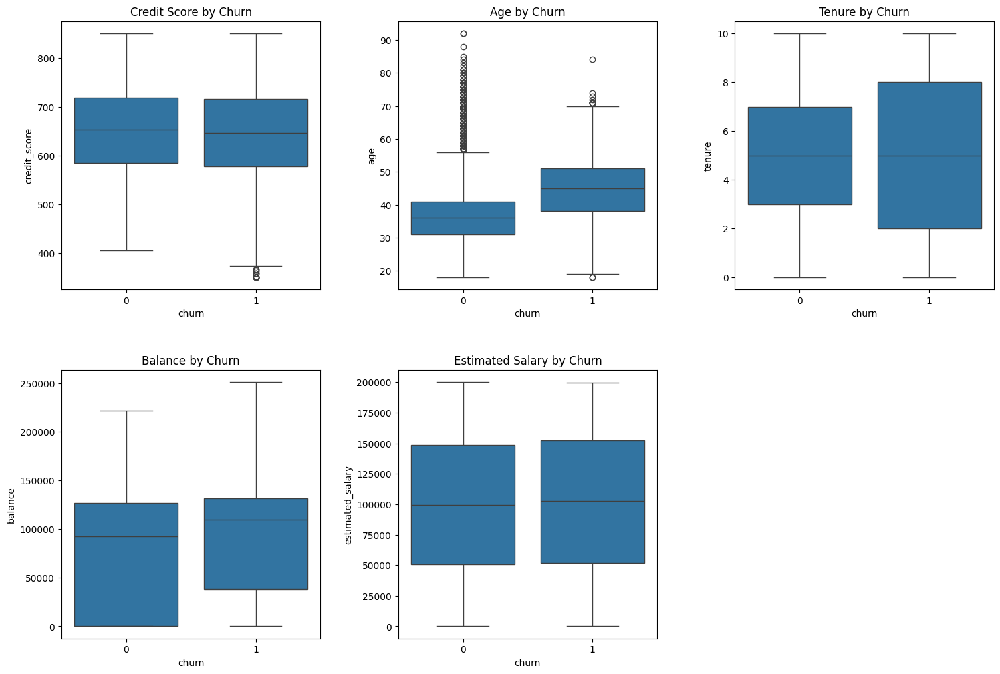
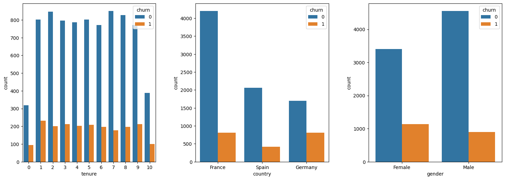
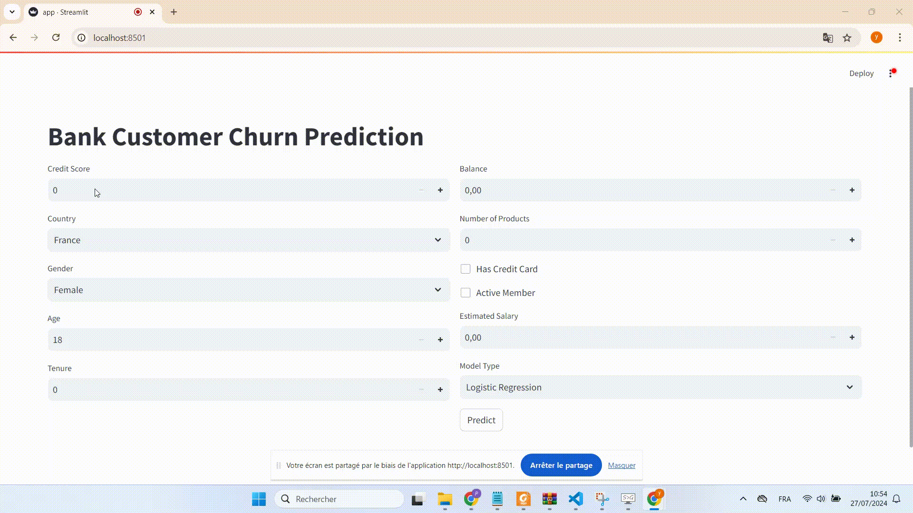

# Bank Customer Churn Prediction


Using a dataset of 10,000 bank records, we developed an application to predict the likelihood of customer churn. The following steps outline the process:

## Steps to Predict Customer Churn

### 1. Clean the Data
By reading the dataset into a dataframe using pandas, we removed unnecessary data fields including individual customer IDs and names. This left us with columns for Credit Score, Country, Gender, Age, Tenure, Balance, Number Of Bank Products Used, Has a Credit Card, Is an Active Member, Estimated Salary, and Churn.

### 2. Analyze Initial DataFrame
Utilizing Matplotlib, Seaborn, and Pandas, we analyzed the data to find that our dataset was imbalanced. The majority class, "Stays" (0), has around 80% data points and the minority class, "Churn" (1), has around 20% data points. To address this imbalance, we utilized SMOTE (Synthetic Minority Over-sampling Technique) in our machine learning algorithms.

- **Data Analysis Visualizations:**




### 3. Machine Learning Models
We tested three different machine learning models to predict customer churn:
- Logistic Regression
- Random Forest
- Support Vector Machine (SVM)

We used SMOTE to handle the imbalanced data for the SVM model, which improved our recall results.

### 4. Load Models and Display Predictions on App
Finally, we created a user-facing app using FastAPI and Streamlit. The app allows users to input information and predict customer churn based on our models.

- **App Demonstration Video:**
  


## Running the Application

To run the application, follow these steps:

1. Clone the repository:
   ```bash
   git clone <repository_url>

2. Change directory to the project folder:

    ```bash
    cd Bank_Customer_Churn

   
3. Start the FastAPI backend:

    ```bash
    uvicorn main:app --reload

4. Run the Streamlit app:

    ```bash
    streamlit run streamlit_app.py
